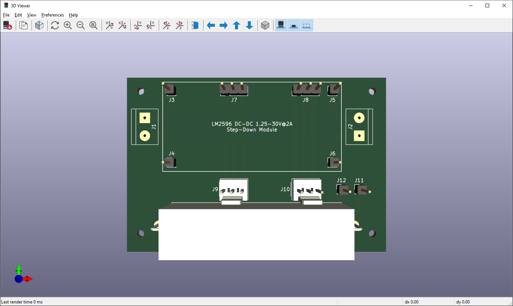
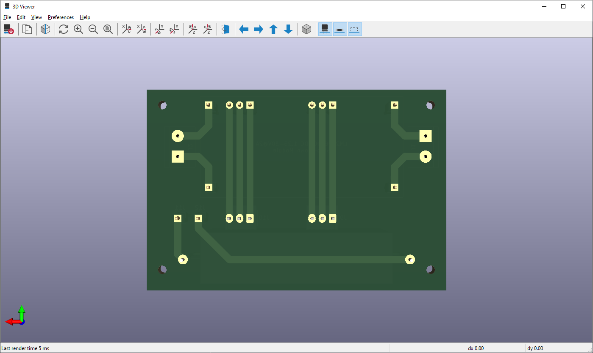

# Laboratory Power Supply Unit - LM2596 Module

Electronic adjustable laboratory power supply unit based on LM2596 DC-DC Step-Down module. Output 1.7-30V, max 2A, with current limitation feature (Work-In-Progress).  

Based on videos (spanish):  
- [Control de Corriente para Fuente DC-DC LM2596](https://www.youtube.com/watch?v=ucfL-aOuTAA) from [KrissElectronics](https://www.youtube.com/@KrissElectronics) YouTube channel.
- [Fuente DC-DC LM2596, Control Externo Feedback](https://www.youtube.com/watch?v=mXjmIwHC1IA) from [Electgpl](https://www.youtube.com/@electgpl) YouTube channel.
- [Control de Corriente para DC-DC con LM2596, CC/CV con LM358](https://www.youtube.com/watch?v=a19zc0bWBYk) from [Electgpl](https://www.youtube.com/@electgpl) YouTube channel.

&nbsp;

This project use the following electronic components:
- 1 x LM2596 DC-DC Step-Down module (with current limitation).
- 1 x Voltimeter+Amperimeter DSN-VC288.
- 2 x Potenciometers B10K (lineal)
- 2 x Borniers.
- 2 x 3 pins connectors.
- 1 x DC Jack female connector.

&nbsp;

### Screenshots

| Diagram - Schematics                               | Diagram - PCB                                      |
|----------------------------------------------------|----------------------------------------------------|
|             |                   |

| Diagram - PCB Render                               | Diagram - PCB Render                               |
|----------------------------------------------------|----------------------------------------------------|
|         |          |

| Prototype                                          | PCB Manufacturing                                  |
|----------------------------------------------------|----------------------------------------------------|
|             |             |

| PCB Assembly                                       | Project Assembly                                   |
|----------------------------------------------------|----------------------------------------------------|
|             |             |

| Project Final                                      | Project Final (YouTube video)                      |
|----------------------------------------------------|----------------------------------------------------|
|             |             |

See 'Rescources' sub-folder for more pictures & videos of the project.

&nbsp;

### Version History

v1.0 (2023.06.07) - Initial release.  

&nbsp;

This source code is licensed under GPL v3.0  
Please send me your feedback about this project: andres.garcia.alves@gmail.com
